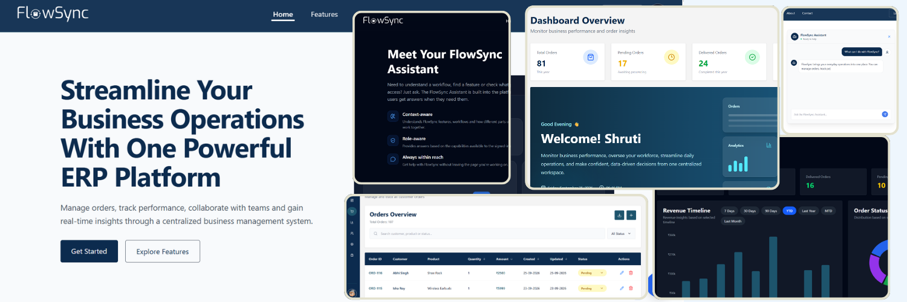
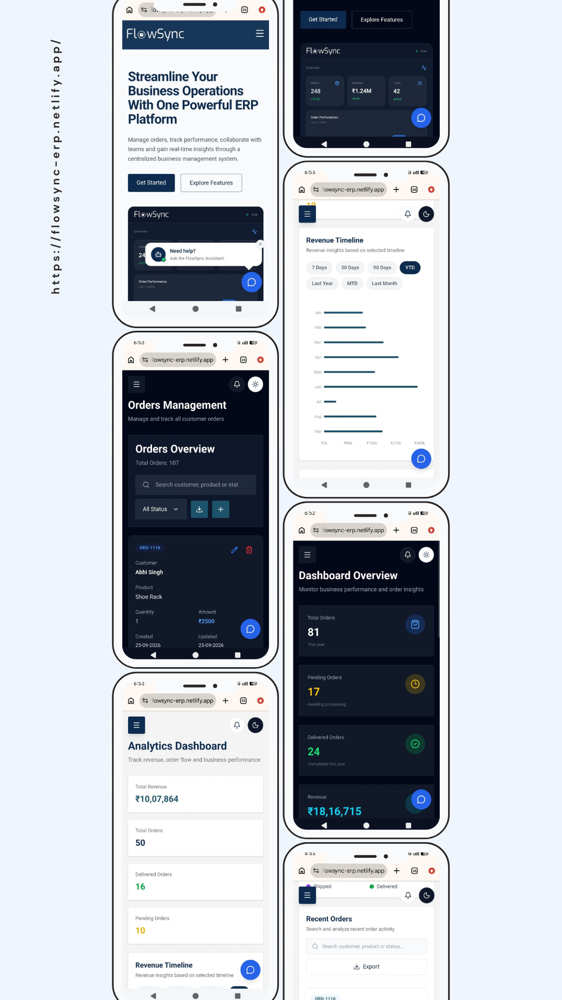

# FlowSync

FlowSync is a full-stack business management platform built with the MERN stack.

I built it to go beyond a basic CRUD application and understand how different parts of a real-world application work together - authentication, permissions, APIs, real-time updates, analytics, AI, third-party services, security, and deployment.

**Live:** https://flowsync-erp.netlify.app/

---

## ◈ Screenshots

### Desktop



### Responsive Mobile Experience

<p align="center">
  
</p>

---

## ◈ What FlowSync Does

FlowSync is designed around everyday business operations.

Users can:

- Manage and track orders
- Manage employees and their access
- Assign roles and granular permissions
- Request, approve, and reject permissions
- Monitor business analytics and revenue
- Export data
- Track activity and administrative changes
- Manage their profile and avatar
- Use an AI assistant for application-related help
- Receive real-time updates

The application currently supports:

```text
Admin · Manager · Operations · Analyst · Employee
```

Roles define the user's baseline access, while individual permissions control what they can actually do.

---

## ◈ Key Features

### Authentication & Security

- JWT authentication
- Email verification
- Forgot/reset password
- Protected routes and APIs
- bcrypt password hashing
- Role-based access control
- Granular permissions
- API rate limiting
- Chatbot rate limiting
- File upload validation and size limits
- Production-safe error handling

### Order Management

- Create, update and delete orders
- Search, sorting and pagination
- Order status workflow:

```text
Pending → Processing → Shipped → Delivered
```

- Duplicate order prevention
- Order and revenue tracking

### Analytics

- Revenue and order statistics
- Status breakdowns
- Revenue timelines
- Date-based filtering
- Recent and highest-value orders
- XLSX data export
- Recharts visualizations

### Employee & Permission Management

- Employee management
- Role updates
- Individual permission management
- Permission requests
- Approval/rejection workflow
- Audit tracking

### Real-Time & AI

- Real-time updates with Socket.IO
- Google Gemini-powered AI assistant
- Role and permission-aware AI context
- Conversation history for authenticated users
- Rate-limited AI requests

### Profile & UI

- Profile management
- Password change
- Image upload
- DiceBear avatar generation
- Cloudinary image storage
- Light/dark mode
- Responsive desktop, tablet and mobile UI
- Toast notifications and animated interactions

---

## ◈ Tech Stack

### Frontend

`React` · `Vite` · `React Router` · `Tailwind CSS` · `Framer Motion` · `Axios` · `Recharts` · `Socket.IO Client` · `Lucide React` · `React Icons` · `React Markdown` · `React Hot Toast` · `Next Themes` · `XLSX` · `React Helmet Async`

### Backend

`Node.js` · `Express.js` · `MongoDB` · `Mongoose` · `JWT` · `bcryptjs` · `Socket.IO` · `Multer`

### Services

`Google Gemini` · `Cloudinary` · `DiceBear` · `Brevo` · `Web3Forms` · `MongoDB Atlas`

### Deployment

`Netlify` - Frontend  
`Render` - Backend  
`MongoDB Atlas` - Database  
`Cloudinary` - Image Storage

---

## ◈ Project Structure

```text
FlowSync/
│
├── client/
│   └── src/
│       ├── api/
│       ├── components/
│       ├── context/
│       ├── layouts/
│       ├── pages/
│       ├── routes/
│       ├── services/
│       ├── seo/
│       └── utils/
│
├── server/
│   ├── config/
│   ├── controllers/
│   ├── middleware/
│   ├── models/
│   ├── routes/
│   ├── utils/
│   └── server.js
│
└── README.md
```

---

## ◈ Deployment

The application is split into independent frontend and backend services:

```text
User
  │
  ▼
Netlify
  │
  │ REST API / Socket.IO
  ▼
Render
  │
  ├── MongoDB Atlas
  ├── Cloudinary
  ├── Google Gemini
  └── Brevo / Web3Forms
```

This setup also gave me practical experience with production environment variables, CORS, SPA routing, API configuration, cloud services and deployment troubleshooting.

---

## ◈ Run Locally

### Requirements

`Node.js 22+` · `npm` · `MongoDB` · `Git`

### Clone

```bash
git clone YOUR_GITHUB_REPOSITORY_URL
cd FlowSync-ERP
```

### Install dependencies

```bash
cd client
npm install

cd ../server
npm install
```

### Environment variables

Create `server/.env` and `client/.env` using the provided `.env.example` files.

Never commit credentials or API keys to the repository.

### Start backend

```bash
cd server
npm start
```

### Start frontend

```bash
cd client
npm run dev
```

---

## ◈ What I Learned Building It

The biggest value of FlowSync for me was connecting technologies together instead of learning them in isolation.

While building it, I worked hands-on with:

- Designing a React + Node.js full-stack architecture
- REST API development with Express
- MongoDB schema and query design with Mongoose
- JWT authentication and server-side authorization
- RBAC and granular permission systems
- Real-time communication with Socket.IO
- Integrating external APIs and cloud services
- Adding AI functionality with Gemini
- Handling uploads with Multer and Cloudinary
- Data visualization and reporting
- API protection and production security
- Environment configuration and CORS
- Deploying a frontend and backend separately
- Production troubleshooting and hardening
- SEO basics with page metadata, canonical URLs, sitemap and `robots.txt`

One of the most useful lessons was realizing that building a feature is only one part of development. Making sure it behaves correctly, handles errors, protects the API, works on different screen sizes, and survives deployment is a completely different part of the job.

---

## ◈ Explore the Project

If you find the project interesting, feel free to visit the live application, explore the repository, fork it, or share feedback.

**Portfolio:** https://shrutidubey.netlify.app/  
**Email:** shruti.kashyap.dubey@gmail.com

Thanks for taking the time to look through FlowSync.